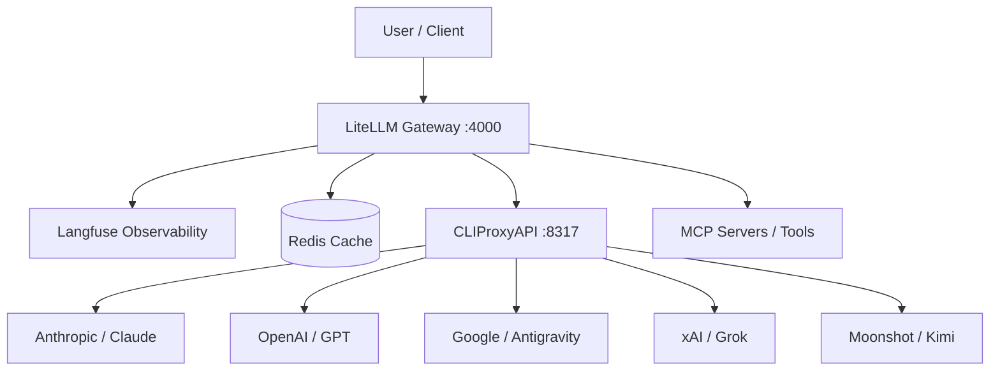

# AI Gateway Stack

This repository manages a production-grade AI Gateway using **LiteLLM**, **Langfuse**, and **CLIProxyAPI**. It provides a unified, reliable, and observable interface for 100+ LLMs using consumer subscriptions (OpenAI, Anthropic, Google) instead of pay-per-token API billing.

## Core Components

### 1. LiteLLM (The Gateway)
Acts as a universal adapter for LLMs.
*   **Unified API:** Access OpenAI, Anthropic, Gemini, and more via a single OpenAI-compatible format.
*   **Reliability:** Handles fallbacks (e.g., "if GPT-4 fails, try Claude 3"), retries, and load balancing.
*   **Model Agnostic:** Swap providers by changing one line of config without refactoring application logic.

### 2. Langfuse (Observability & Analytics)
Provides the "dashboard" and tracing layer for all AI calls.
*   **Full Tracing:** Records every input, output, latency, and metadata field.
*   **Cost Tracking:** Visualizes spend and usage across providers in a single pane of glass.
*   **Evaluation:** Run automated "Evals" and collect feedback to improve model performance.

### 3. CLIProxyAPI (The Relay)
A specialized proxy that allows LiteLLM to use consumer-tier accounts (ChatGPT Plus, Claude Pro, Gemini Advanced / Antigravity, X Premium).
*   **No Token Billing:** Uses your existing subscriptions.
*   **OAuth Management:** Handles token refreshes and session persistence for OpenAI, Anthropic, Google (via Antigravity CLI), xAI (Grok), and Moonshot (Kimi).

## Advanced Capabilities

### Agents & Tool Use
*   **Model-Agnostic Agents:** Build agents that can reason across any model in the gateway.
*   **MCP (Model Context Protocol):** Connect models to external tools (GitHub, Slack, SQL) using an open standard. LiteLLM can auto-register MCP servers, decoupling tools from model providers.
*   **Search Tools:** The stack supports AI-native search (Tavily, Exa) and zero-key traditional search (DuckDuckGo). These act as the "eyes and ears" of the agent, providing real-time grounding and reducing hallucinations.

### Optimization Layer
*   **Proactive Routing:** The gateway is configured with `enable_pre_call_checks: true`. This allows LiteLLM to locally tokenize and count prompts before sending them. If a prompt exceeds a specific model's context window, it is instantly routed to a larger fallback model, eliminating the "double latency" of a provider-side failure.
*   **Caching:** Reduces latency and costs by storing previous responses in Redis. If two users ask the same question, the result is served in milliseconds without hitting the LLM.
*   **Vector Stores:** Integrate with stores like Pinecone or Qdrant for **RAG (Retrieval-Augmented Generation)**, giving agents "long-term memory" and access to private data.

### Claude Code Plugins
*   Modular, shareable packages that extend the AI's capabilities in the local environment.
*   Bundle specialized agents, custom slash commands, and MCP servers into unified units for team-wide AI workflows.

## Routing & Reliability

The gateway uses LiteLLM's internal router to ensure high availability and smart traffic distribution.

### Proactive Routing
The gateway is configured with `enable_pre_call_checks: true`. This allows LiteLLM to locally tokenize and count prompts before sending them. If a prompt exceeds a specific model's context window, it is instantly routed to a larger fallback model, eliminating the "double latency" of a provider-side failure.

### Routing Strategies
The following strategies are available and can be configured globally or per-key:

1.  **`simple-shuffle` (Current Default):** Randomly distributes requests across all available healthy deployments of a model. This is the best strategy for balancing load across multiple consumer accounts.
2.  **`usage-based-routing`:** Routes traffic to the deployment with the lowest current usage (RPM or TPM). Ideal for staying under strict consumer rate limits.
3.  **`latency-based-routing`:** Measures response times and automatically routes requests to the fastest provider at that moment.
4.  **`least-busy`:** Routes to the deployment with the fewest active requests.

### Fallback Logic
The gateway is built to assume that consumer-tier accounts will hit rate limits (429 errors).
*   **Automatic Cooldown:** When a model hits a rate limit, it is placed on a 60-second "cooldown" and skipped by the router.
*   **Model Escalation:** If your preferred model (e.g., `claude-opus`) is exhausted, the router will automatically attempt the request with a sibling model (e.g., `claude-sonnet`) or a different provider (e.g., `gpt-5`).

## Client Considerations (Cursor / IDEs)

When using the gateway with smart clients like **Cursor**, keep the following in mind regarding automated fallbacks:

1.  **Metadata Visibility:** By default, LiteLLM returns the actual model used in the response metadata. If a fallback occurs (e.g., from Claude to Gemini), Cursor will see the new model ID.
2.  **Formatting Drift:** Different models have different output styles. A fallback might result in code blocks or reasoning styles that differ from the primary model, which could occasionally affect Cursor's ability to "Auto-Apply" changes.
3.  **Proactive vs. Reactive:** While Cursor manages its own context pruning, the gateway's `enable_pre_call_checks` acts as a safety net for other CLI tools or when Cursor's internal math slightly exceeds provider limits.

### Cursor Setup Guide

To use this gateway in Cursor, follow these steps:

1.  **Open Settings:** Go to `Cursor Settings` -> `Models`.
2.  **Configure OpenAI API:**
    *   **API Base URL:** `http://localhost:4000/v1`
    *   **API Key:** Use the `LITELLM_MASTER_KEY` from your [`.env`](.env.example) file.
3.  **Manage Models:**
    *   **Disable default models** (like Cursor's built-in Claude) to ensure all traffic routes through your local gateway for tracking and cost management.
    *   **Add Custom Models:** Click `+ Add Model` and enter the IDs exactly as they appear in [`litellm-config.yaml`](litellm-config.yaml).
4.  **Recommended Model IDs:**
    *   `claude-sonnet-4-6` (Standard)
    *   `claude-sonnet-4-6-high` (Deep Thinking mode)
    *   `gemini-pro-agent-high` (Google's agentic reasoning)
    *   `gpt-5-5` (Latest OpenAI flagship)
5.  **Verify Connection:** Use the `Cursor Chat` and ask a question. Check your **Langfuse dashboard** (`http://localhost:3000`) to verify the request was captured.

## Documentation Index
*   [docs/TENANCY.md](./docs/TENANCY.md): Foundational tenancy and workspace domain model design.
*   [docs/CLIENT_COMPATIBILITY.md](./docs/CLIENT_COMPATIBILITY.md): Supported client compatibility matrix and integration profiles.
*   [MODELS.md](./MODELS.md): Detailed reference for available models, rate limits, and authentication.
*   [RUNBOOK.md](./RUNBOOK.md): Commands for setup, maintenance, and troubleshooting.
*   [docs/ROADMAP.md](./docs/ROADMAP.md): Active roadmap focus and explicitly deferred platform-control areas.
*   [docs/ARCHITECTURE.md](./docs/ARCHITECTURE.md): MCP control-plane architecture decision record.
*   [docs/ADAPTIVE_ROUTING.md](./docs/ADAPTIVE_ROUTING.md): Adaptive provider routing design, telemetry plan, and implementation roadmap.
*   [docs/ADMIN_CONSOLE.md](./docs/ADMIN_CONSOLE.md): Unified admin console use cases, data sources, approach, and child-issue plan.
*   [docs/ADMIN_CONSOLE_DATA_CONTRACT.md](./docs/ADMIN_CONSOLE_DATA_CONTRACT.md): Read-only admin console panel payload contract and fixtures.

---

## Architecture Overview

