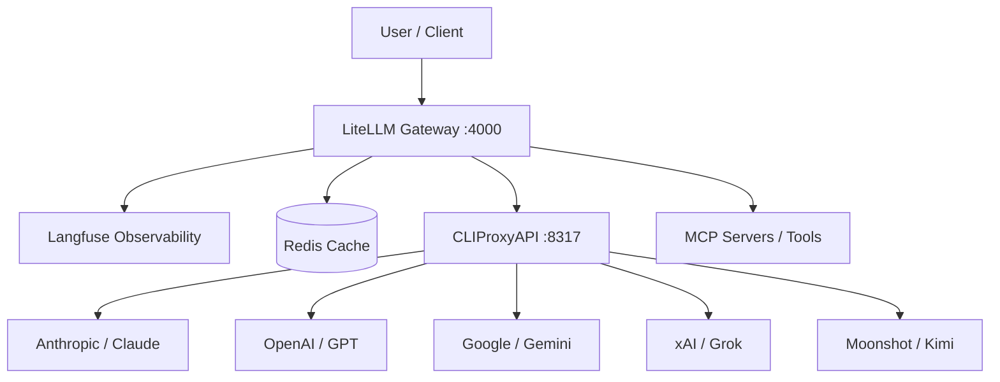

# AI Gateway Stack

This repository manages a production-grade AI Gateway using **LiteLLM**, **Langfuse**, and **CLIProxyAPI**. It provides a unified, reliable, and observable interface for 100+ LLMs using consumer subscriptions (OpenAI, Anthropic, Google) instead of pay-per-token API billing.

## Core Components

### 1. LiteLLM (The Gateway)
Acts as a universal adapter for LLMs.
*   **Unified API:** Access OpenAI, Anthropic, Gemini, and more via a single OpenAI-compatible format.
*   **Reliability:** Handles fallbacks (e.g., "if GPT-4 fails, try Claude 3"), retries, and load balancing.
*   **Model Agnostic:** Swap providers by changing one line of config without refactoring application logic.

### 2. Langfuse (Observability & Analytics)
Provides the "dashboard" and tracing layer for all AI calls.
*   **Full Tracing:** Records every input, output, latency, and metadata field.
*   **Cost Tracking:** Visualizes spend and usage across providers in a single pane of glass.
*   **Evaluation:** Run automated "Evals" and collect feedback to improve model performance.

### 3. CLIProxyAPI (The Relay)
A specialized proxy that allows LiteLLM to use consumer-tier accounts (ChatGPT Plus, Claude Pro, Gemini Advanced, X Premium).
*   **No Token Billing:** Uses your existing subscriptions.
*   **OAuth Management:** Handles token refreshes and session persistence for OpenAI, Anthropic, Google, xAI (Grok), and Moonshot (Kimi).

## Advanced Capabilities

### Agents & Tool Use
*   **Model-Agnostic Agents:** Build agents that can reason across any model in the gateway.
*   **MCP (Model Context Protocol):** Connect models to external tools (GitHub, Slack, SQL) using an open standard. LiteLLM can auto-register MCP servers, decoupling tools from model providers.

### Optimization Layer
*   **Caching:** Reduces latency and costs by storing previous responses. If two users ask the same question, the result is served in milliseconds without hitting the LLM.
*   **Vector Stores:** Integrate with stores like Pinecone or Chroma for **RAG (Retrieval-Augmented Generation)**, giving agents "long-term memory" and access to private data.

### Claude Code Plugins
*   Modular packages that extend the AI's capabilities in the local environment.
*   Bundle specialized agents, custom slash commands, and MCP servers into shareable units for team-wide AI workflows.

## Documentation Index
*   [MODELS.md](./MODELS.md): Detailed reference for available models, rate limits, and authentication.
*   [RUNBOOK.md](./RUNBOOK.md): Commands for setup, maintenance, and troubleshooting.

---

## Architecture Overview

