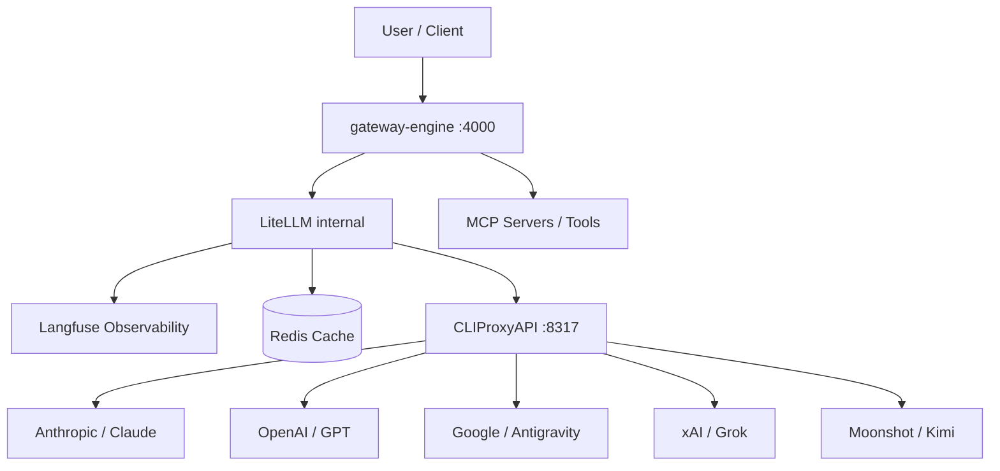

# AI Gateway Stack

[](https://github.com/echoares-lab/ai-gateway/releases/tag/v0.2.0)

Production-grade AI gateway built on **LiteLLM**, **Langfuse**, and **CLIProxyAPI**.
It exposes a single OpenAI-compatible endpoint for 100+ models, backed by consumer
subscriptions (OpenAI, Anthropic, Google, xAI, Moonshot) instead of pay-per-token
API billing.

Clients hit **`gateway-engine` on port `4000`** (format translation, model prefixing,
policy). LiteLLM runs behind it as the model router/adapter; Langfuse provides tracing
and cost analytics; CLIProxyAPI relays to consumer-tier OAuth accounts.


```mermaid
graph TD
    User[User / Client] --> GE[gateway-engine :4000]
    GE --> LiteLLM[LiteLLM internal]
    LiteLLM --> Langfuse[Langfuse Observability]
    LiteLLM --> Cache[(Redis Cache)]
    LiteLLM --> CLIProxy[CLIProxyAPI :8317]
    CLIProxy --> Anthropic[Anthropic / Claude]
    CLIProxy --> OpenAI[OpenAI / GPT]
    CLIProxy --> Google[Google / Antigravity]
    CLIProxy --> xAI[xAI / Grok]
    CLIProxy --> Kimi[Moonshot / Kimi]
    GE --> MCP[MCP Servers / Tools]
```

## Run

```bash
cp .env.example .env          # then fill in secrets (see the vault runbook)
docker compose up -d          # production-shaped stack
./dev-env.sh up               # local development stack
```

Key endpoints: gateway-engine `http://localhost:4000/v1`, Langfuse
`http://localhost:3000`, CLIProxyAPI `http://localhost:8317`, docs-server
(interactive Scalar OpenAPI browser) `http://localhost:8002`.

## Test

```bash
make lint          # ruff / shellcheck
make test-unit     # unit tests
make test-mock     # mock-upstream suite (no OAuth, no real LLM calls)
make test-fast     # full pre-PR gate: lint + unit + validators + mock
make test-e2e      # real-provider E2E (requires a running stack + credentials)
```

> [!WARNING]
> **Always invoke a named target.** There is no `help` target and no default
> goal, so a bare `make` falls through to the first rule in the `Makefile` —
> `clean-db` — which runs `docker volume rm ai_langfuse_postgres_data` and
> `docker volume prune -f`, destroying your local Langfuse database.

## Documentation

All project documentation — architecture, specs, ADRs, runbooks, roadmap, and
task backlog — lives in the Obsidian vault, **not** in this repository
(Master-Policy §1.6, Obsidian-First Documentation Minimalism):

> `/home/dev/obsidian-vault/01 Projects/AI-Gateway/`
>
> - `Overview.md`, `Architecture.md`, `Tech-Stack.md`, `Todo.md`
> - `Specs/` — service architecture, routing, client compatibility, models,
>   roadmap, contracts, design and implementation plans
> - `Runbooks/` — operations, dependency updates, CLIProxy cutover

Agent directives live in [`AGENTS.md`](AGENTS.md).

The `docs/` directory in this repository is **not** documentation: it holds the
OpenAPI specifications published at runtime by the `docs-server` service plus a
few machine-verified contract files. See [`docs/README.md`](docs/README.md).
