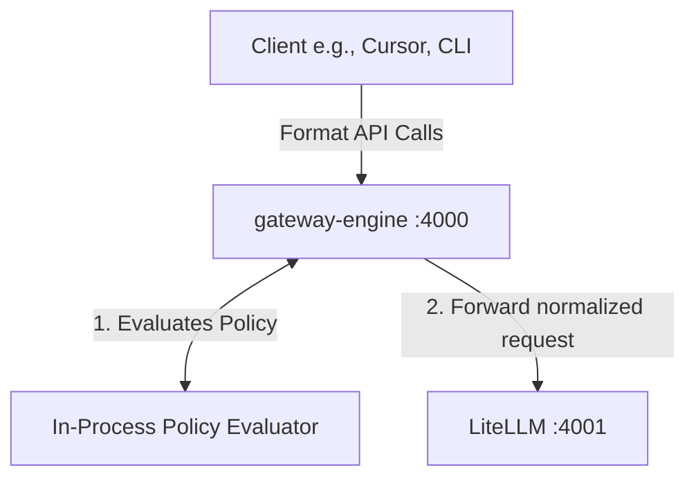
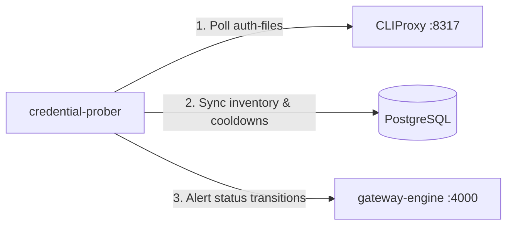

# AI Gateway Service Architecture

This document provides a comprehensive overview of the specialized services within the AI Gateway repository. It explains their roles, features, interactions, and current lifecycle status.

---

## Service Inventory at a Glance

| Service Name | Scope / Packaging | Runtime Port | Primary Role | Status |
| :--- | :--- | :--- | :--- | :--- |
| **`gateway-engine`** | Core Docker Service | `4000` | Format translation proxy, auth normalization, and policy routing. | **Active** |
| **`credential-prober`** | Background Worker | N/A | Imports, refreshes, and evaluates provider account health and cooldown status. | **Active** |
| **`docs-server`** | Admin Documentation | `8002` (internal `8000`) | Serves interactive Scalar OpenAPI specifications. | **Active** |
| **`mcp-postgres`** | Model Context Protocol | N/A (stdio transport) | Read-only SQL schema inspection and query execution for LLMs. | **Active** |
| **`policy-engine`** | In-process Library | N/A (integrated in `gateway-engine`) | Routing policy logic (affinity, budget, rate-limits, fallbacks). | **Active (Integrated)** |
| **`litellm-reloader`** | Decommissioned | N/A | Watched config files to trigger LiteLLM restarts. | **Decommissioned** |

---

## 1. gateway-engine (Translation Proxy)

`gateway-engine` serves as the public entry point for all client traffic. It handles format normalization between developer-centric CLI formats and the downstream LiteLLM adapter.

### Core Features
- **Format Translation**: Translates incoming requests from multiple CLI interfaces:
  - **Cursor / Responses API**: `POST /v1/chat/completions` (OpenAI hybrid)
  - **Gemini CLI**: `POST /v1beta/models/{model_action}`
  - **Codex CLI**: `POST /v1/responses`
  - **Claude CLI**: `POST /v1/messages`
- **Auth Normalization**: Standardizes request credentials (such as passing Gemini `?key=...` or Claude `x-api-key` query/header parameters into standard downstream `Authorization: Bearer` headers).
- **In-Process Policy Routing**: Applies budgets, rate limits, model capability fallbacks, and agent affinity before forwarding queries downstream.
- **Admin Control Panel**: Exposes dynamic administration endpoints on `/admin/*` and a visual `/admin/dashboard` panel for operations, model registry mutations, and metrics aggregation.

---

## 2. credential-prober (Credential Health Monitor)

`credential-prober` is a background daemon designed to proactively monitor and synchronize CLIProxy OAuth account health, preventing degraded or critical credentials from causing request failures.

### Core Features
- **Discovery Synchronization**: Polls CLIProxy's `/v0/management/auth-files` and filters out internal or system records to populate the `credential_inventory` PostgreSQL database table.
- **Error Discrimination**: Distinguishes between transient/recoverable errors (like 429 rate limits, transient upstreams) and hard authentication errors (such as 401 unauthorized, suspended accounts).
- **Proactive Cooldown Lockout**: Computes cooldown time windows (`cool_down_until`). Degraded credentials get a short cooldown (default: 60s), while critical errors receive a long suspension cooldown (default: 7 days).
- **Engine State Alerts**: Posts transition events to the `gateway-engine` endpoint `/v1/events/credential` to trigger real-time routing adjustments, while also dispatching alerts to Slack.

---

## 3. docs-server (Interactive Documentation Server)

`docs-server` provides a unified hub for developer and operator API documentation by rendering OpenAPI specifications in a beautiful, interactive Scalar web interface.

### Core Features
- **Scalar Reference UI**: Serves interactive, visual API documents featuring an inline "Try it out" HTTP client.
- **Automatic Hot-Reloading**: Reads specifications directly from `docs/openapi/` using volume mounts, allowing documentation updates to propagate instantly without server restarts.
- **Available API Spec Directory**:
  - `gateway-engine.yaml` (Exposed Gateway Engine endpoints and admin operations)
  - `cliproxy.yaml` (CLIProxy API controls)
  - `litellm.yaml` (LiteLLM core models and key schemas)
  - `cpa-manager.yaml` (Usage analytics and tracking contracts)
  - `policy-engine.yaml` (Historical reference for policy and trace structures)

---

## 4. mcp-postgres (PostgreSQL MCP Server)

`mcp-postgres` is an implementation of the Model Context Protocol (MCP) that safely exposes read-only operations on a PostgreSQL database as tools that LLMs can invoke.

### Core Features
- **FastMCP Integration**: Utilizes the FastMCP framework for automated tool schema generation.
- **Strict Read-Only Guardrails**:
  - Validates query strings to ensure they start with `SELECT`.
  - Rejects queries containing DDL or mutative DML keywords (`INSERT`, `UPDATE`, `DROP`, `ALTER`, `CREATE`, etc.).
  - Explicitly enforces a database connection-level read-only session (`readonly=True`).
- **Context Preservation**: Truncates output to a maximum of 50 rows to protect LLM context windows and token efficiency.
- **Stdio Transport**: Executed as a child sub-process by LiteLLM over stdin/stdout pipes, inheriting strict process-level boundaries.

---

## 5. policy-engine (In-process Evaluator)

> [!NOTE]
> The standalone `policy-engine` microservice has been decommissioned. Its core logic and models are now fully integrated as an in-process package inside `gateway-engine` at [core/policy](file:///home/dev/repos/ai-gateway/services/gateway-engine/core/policy).

### Core Features
- **Repository & Agent Affinity**:
  - Pins requests initiated by the same agent ID (e.g. Cursor session) to the same provider credential to maximize cache hits.
  - Resolves allowed models based on workspace/repository policy rules.
- **Budget Gates**: Blocks or warns when team or workspace budgets have been exhausted.
- **Pre-emptive Rate Limit Cooldown**: Pre-emptively shifts traffic away from credentials approaching their rate limits or currently locked in a cooldown period.
- **Dynamic Fallbacks**: Computes ordered lists of fallback deployments based on real-time health scores, cost tiers, and capabilities (such as tool-calling support).

---

## 6. litellm-reloader (Decommissioned)

> [!WARNING]
> The `litellm-reloader` service was decommissioned and removed in PR #290.

### Rationale & Replacement
Originally, `litellm-reloader` watched the static `litellm-config.yaml` file on disk, performed offline YAML pre-flight syntax checks, and restarted the LiteLLM container on change. 

This model has been replaced because:
1. LiteLLM supports dynamic model addition and removal directly via runtime API endpoints (`POST /model/new` and `POST /model/delete`).
2. `gateway-engine` manages these dynamic actions natively, executing transaction-safe mutations on both its internal model registry (PostgreSQL) and the LiteLLM runtime without requiring service restarts.
3. Offline YAML validation is now shifted left into the GitHub Actions CI pipeline (`lint-and-syntax`) and pre-commit Git hooks.
